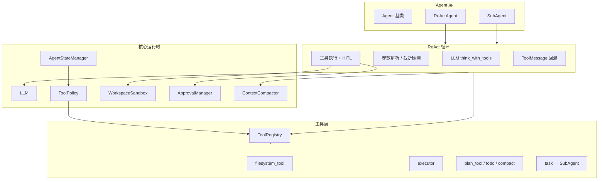

# MiniCC

轻量级 **ReAct Agent 框架**：基于 LLM Tool Calling，把「思考 → 调用工具 → 观察结果」封装为可扩展的单 Agent 运行时。所有能力通过工具（Tool）注入，不硬编码业务逻辑。

> 架构图见项目 `docs/agent-framework-architecture.drawio`（及导出的 PNG）。

---

## 总体架构



**设计原则**

| 原则 | 说明 |
|------|------|
| 工具驱动 | 文件读写、命令执行、规划、子任务委派均为独立 Tool |
| 模式隔离 | `active` / `plan` 两套工具可见性，Plan 阶段禁止写操作 |
| 沙箱约束 | 所有路径操作限制在工作区根目录内 |
| 人机协同 | 写/删/危险命令执行前需 HITL 审批 |
| 上下文治理 | 三层压缩，避免长对话撑爆 token |

---

## 核心模块

### Agent 层

| 模块 | 功能 |
|------|------|
| `core/agent.py` | Agent 抽象基类，持有 LLM、Registry、StateManager |
| `agents/react_agent.py` | 主 Agent 入口，`run(prompt)` 启动 ReAct 循环 |
| `agents/react_loop.py` | 共享循环逻辑，ReActAgent 与 SubAgent 复用 |
| `agents/sub_agent.py` | 隔离上下文的子任务执行器，由 `task` 工具调用 |

**ReAct 循环**（最多 50 步）：

```text
准备上下文（压缩 / todo 提醒）
  → LLM 推理（含 thinking）
  → 有 tool_calls？
      是 → 解析参数 → HITL → 执行工具 → ToolMessage 回灌 → 下一轮
      否 → 输出 Final Answer，结束
```

### LLM 层

`core/llm.py` 封装 OpenAI 兼容接口（默认 Qwen 系列）：

- `think()` — 普通对话
- `think_with_tools()` — Tool Calling，`enable_thinking` 开启推理链
- 推理内容封装为 `=== THINKING === ... === END THINKING ===` 前缀
- 检测 `finish_reason=length` 截断，跳过畸形 tool_call

### 状态与策略

| 模块 | 功能 |
|------|------|
| `core/state_manager.py` | 运行时状态：`mode`、规划、todo、压缩状态、`context_summary` |
| `core/tool_policy.py` | **唯一**工具可见性策略源，按 mode 过滤 |
| `core/todo_manager.py` | 会话内 todo 面板，支持 reminder 注入循环 |

**两种运行模式**

| 模式 | 典型工具 | 用途 |
|------|----------|------|
| `plan` | `list_dir`、`read_file`、`grep`、`planner`、`todo`、`compact` | 只读分析 + 结构化规划 |
| `active` | `write_file`、`edit_file`、`delete_file`、`executor`、`task` 等 | 读写执行 |

通过 `enter_plan_mode` / `exit_plan_mode` 切换。

### 安全层

**工作区沙箱**（`core/workspace_sandbox.py`）

- 启动时配置 `workspace_root`，所有文件工具路径必须落在此目录内
- 越界路径抛出 `WorkspaceSandboxError`

**HITL 审批**（`core/hitl.py`）

- `write_file` / `edit_file` / `delete_file`：一律审批，展示 diff 预览
- `executor`：仅当 argv 含写/删关键词时审批
- 交互选项：`y` / `n` / `a`（本会话放行工具）/ `A`（放行工具+路径）/ `d`（展开预览）
- `MINICC_AUTO_APPROVE=1` 跳过审批（CI / 非交互环境）

**命令白名单**（`tools/executor/command_runner.py`）

- 仅允许 `python`、`java`、`mvn`、`gradle` 等构建/运行类可执行文件
- `shell=False`，带 timeout 与 cwd 限制

### 上下文压缩

`core/context_compactor.py` 三层策略：

| 层级 | 触发 | 行为 |
|------|------|------|
| Layer 1 落盘 | 工具输出 > 8KB | 写入磁盘，历史中只保留预览 + 路径 |
| Layer 2 微压缩 | 每轮自动 | 较早 ToolMessage 替换为占位符，保留最近 5 条 |
| Layer 3 摘要压缩 | `compact` 工具或超阈值 | LLM 摘要历史，保留目标、进度、文件、下一步 |

---

## 工具清单

所有工具继承 `BaseTool`（Pydantic 参数 + `to_openai_tool()`），通过 `register_tool()` 注册到全局 `ToolRegistry`。

### 文件系统（`tools/filesystem_tool/`）

| 工具 | 模式 | 功能 |
|------|------|------|
| `list_dir` | plan / sub | 目录列表，支持递归 |
| `glob` | plan / sub | 按模式匹配文件 |
| `read_file` | plan / sub | 读取文件，支持行范围 |
| `grep` | plan / sub | 内容搜索 |
| `write_file` | active / sub | 新建或覆盖/追加写入 |
| `edit_file` | active / sub | 按行或全文编辑 |
| `delete_file` | active / sub | 删除文件或递归删目录 |

### 命令执行（`tools/executor/`）

| 工具 | 功能 |
|------|------|
| `executor` | 白名单内命令 subprocess 执行，返回 stdout/stderr/exit_code |

### 规划与任务（`tools/plan_tool/`、`todo_tool/`、`compact_tool/`、`task_tool/`）

| 工具 | 功能 |
|------|------|
| `planner` | Plan 模式下用 JSON Schema 生成结构化多步计划 |
| `enter_plan_mode` / `exit_plan_mode` | 切换 plan / active |
| `todo` | 维护会话内 todo 面板（pending / in_progress / completed） |
| `compact` | 手动触发 Layer 3 上下文摘要压缩 |
| `task` | 委派子任务给 SubAgent，返回结构化结果，不污染主 history |

### SubAgent 工具策略

- 默认工具集：文件系统 + `executor`
- 禁止：`task`（防递归）、`planner`、`todo`、`compact`、plan_mode 切换
- 独立 history 与 ContextCompactor，不启用 Layer 3 全量压缩

---

## 消息模型

`messages/` 统一对话结构，均可 `to_openai_format()`：

- `SystemMessage` / `UserMessage` / `AIMessage`
- `ToolMessage` — 工具执行结果
- `ToolCallMessage` — 含 `tool_calls` 的 AI 响应

---

## 目录结构

```text
MiniCC/src/MiniCC/
├── agents/           # ReActAgent · SubAgent · react_loop
├── core/             # LLM · 状态 · 策略 · 沙箱 · HITL · 压缩 · 日志
├── messages/         # 消息类型
├── prompts/          # System Prompt（react / planner / sub_agent / compact）
└── tools/            # 工具实现与注册
    ├── base_tool.py
    ├── tool_registry.py
    ├── filesystem_tool/
    ├── executor/
    ├── plan_tool/
    ├── task_tool/
    ├── todo_tool/
    └── compact_tool/
```

---

## 扩展方式

1. **新增 Tool** — 继承 `BaseTool`，定义 `name` / `description` / `args_schema`，模块末尾 `register_tool(...)`，并在 `tool_policy.py` 中配置可见 mode
2. **新增 Agent** — 继承 `Agent`，复用 `run_react_loop()`，自定义 system prompt 与 `get_tools` 逻辑
3. **扩展状态** — 在 `AgentState.context_summary` 中挂载业务字段，或扩展 `AgentState` 模型

确保新工具模块被 `tools/__init__.py` import，否则注册副作用不会触发。

---

## 运行与配置

```bash
# 在项目根目录
python main.py
python main.py -p "你的任务"
python main.py --workspace ./your_workspace
```

| 环境变量 | 说明 |
|----------|------|
| `LLM_API_KEY` / `LLM_BASE_URL` / `MODEL_NAME` | LLM 连接 |
| `MINICC_WORKSPACE_ROOT` | 工作区沙箱根目录 |
| `MINICC_MAX_TOKENS` | 单次 LLM 最大 token（默认 16384） |
| `MINICC_AUTO_APPROVE` | `1` 跳过 HITL |
| `MINICC_CONTEXT_LIMIT` | 触发自动压缩的字符阈值 |
| `MINICC_PERSIST_THRESHOLD` | 工具输出落盘阈值（默认 8KB） |

**依赖**：Python ≥ 3.10 · openai · pydantic · python-dotenv
